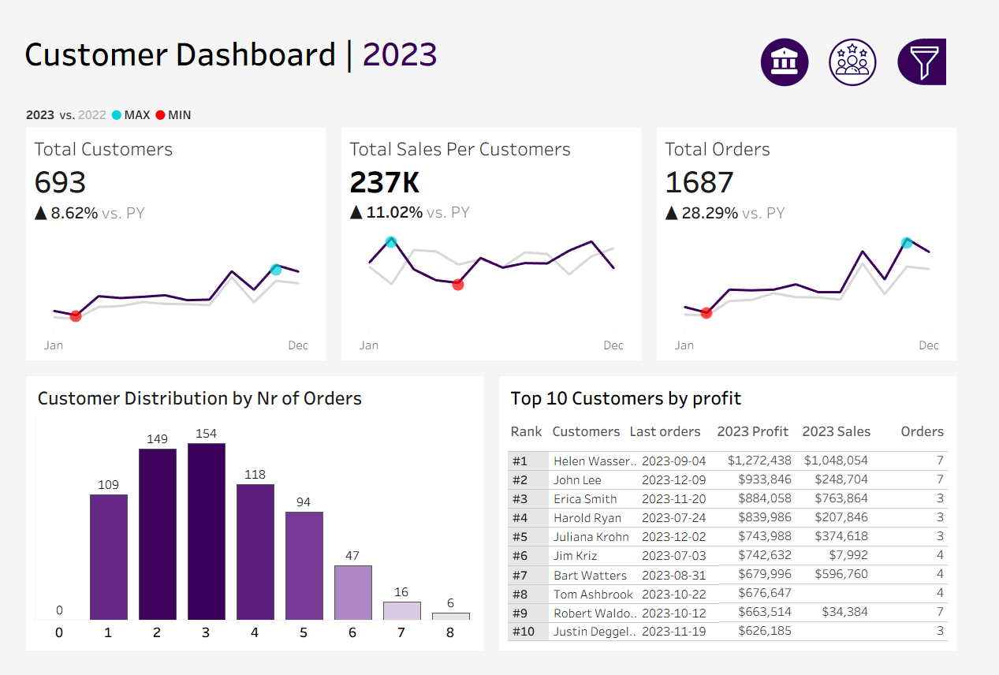

# Tableau

# 📊 Sales & Customer Dashboard (Tableau)

This project presents two interactive Tableau dashboards designed to visualize and analyze key sales and customer metrics from **2020 to 2023** using dynamic filtering and intuitive charts. The dashboards are fully interactive and allow users to explore trends across time, product categories, and customer segments.

## 📈 Sales Dashboard Overview

**Key Metrics:**
- **Total Sales**, **Total Quantity**, and **Total Profit** displayed monthly for the selected year vs. previous year
- Highest and lowest month indicators for each KPI
- Bar and line charts for:
  - **Sales and Profit by Subcategory**
  - **Sales & Profit Trends Over Time**

---

## 👥 Customer Dashboard Overview

**Key Metrics:**
- **Total Customers**, **Total Sales per Customer**, and **Total Orders** with year-over-year comparison
- Monthly performance tracking with max/min highlights
- Visuals include:
  - **Customer Distribution by Number of Orders**
  - **Top 10 Customers by Profit**
    
📌 *All charts are interactive and allow filtering by product category, subcategory, and geography (region, state, city).*

## 📁 Files Included
- `dashboard/Sales and Customer dashboard.twbx`: Tableau workbook file
- `images/`: Contains preview screenshots of the dashboards

📝 Note:  
This dashboard was created as part of my self-directed learning in Tableau using a synthetic dataset. I independently built and designed the dashboard to strengthen my skills in BI tools and data visualization.
